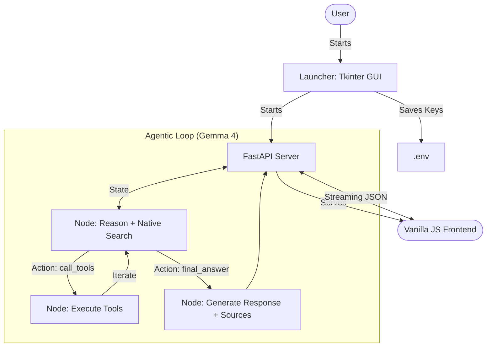

# Architecture: Chat Finance Agentic System 🤖📈

This document provides a detailed overview of the core architecture behind the **Chat Finance** is a premium, agentic financial dashboard powered by **Gemma 4 (31B Dense)**, **LangGraph**, and **FastAPI**. It features a modern, real-time web interface built with **Vanilla JS** and features **Native Google Search Grounding** for top-tier market research.

### Core Technologies
- **Large Language Model**: [Gemma 4 31B Dense](https://blog.google/technology/ai/google-gemma-4/)
- **Search Logic**: Native Google Search Grounding (Zero-latency web research)
- **Frontend**: `Vanilla JS`, `HTML5`, `CSS3` (Modern Finance Dashboard)
- **Backend API**: `FastAPI` (Asynchronous Streaming & Static File Hosting)
- **Launcher**: `Python` + `Tkinter` (Cross-platform GUI for config)
- **Packaging**: `PyInstaller` (Self-contained binary)

---

## 📁 Project Structure

### Desktop Launcher (`launcher.py`)
- **Key Check**: Validates if `.env` exists and contains valid keys.
- **⚙️ Setup**: Quick config via **Tkinter GUI** for `GOOGLE_API_KEY`. (Tavily is no longer required).
- **💎 Premium Dashboard**: Modern "Finance Terminal" UI with glassmorphism, dark mode, and real-time market tickers.
- **💭 Real-time Thinking**: Experience the agent's (Gemma 4) reasoning process as it streams live "thoughts".
- **🇻🇳 Vietnamese Market Data**: Real-time evaluation of VN-Index, VN30, and all major stocks.
- **🔎 Native Search**: Integrated with **Native Google Grounding** for lightning-fast web research and cited sources.

### Backend API (`api.py`)
- **Gateway**: Routes requests to the LangGraph agent.
- **Unified Serving**: Serves the **Vanilla JS** static files (from `frontend/`) on the root route, eliminating the need for a separate frontend server or build process.
- **Streaming**: Uses `StreamingResponse` for real-time thinking steps.

### Core Agent (`/backend`)
- `backend/graph.py`: LangGraph workflow definition.
- `backend/nodes/`: Reasoning, Tool Execution, and Generation.
- `backend/tools/`: Financial and web retrieval tools.

---

## 🔄 Data Flow & Workflow

The updated architecture includes the initialization phase:

---

## 🛠️ Packaging & Distribution

The application is packaged using **PyInstaller**:
1. **Frontend Inclusion**: Static HTML/JS/CSS files are bundled directly.
2. **Bundling**: All Python code, dependencies, and frontend assets are compressed into a single binary.
3. **Distribution**: 
    - **Native Grounding**: Use Native Google Search for real-time validation of financial news.
    - **Linux**: A shell script handles `.desktop` entry creation.
    - **Windows**: A batch file creates a desktop shortcut.

---

## 🛠️ Tool Registry

| Tool | Source | Purpose |
|------|--------|---------|
| `get_stock_price` | yfinance | US equities (AAPL, TSLA) |
| `get_crypto_price` | ccxt/Binance | Crypto prices & 24h trends |
| `get_vn_indices` | vnstock | Market overview (VN-Index, VN30) |
| `get_gold_price` | yfinance | Global Gold (XAU/USD) prices |
| `Google Search` | Native GenAI | Native Search Grounding & Citations |

---

## ⚡ Real-time Feedback

A unique feature of this architecture is the **Streaming Thinking Process**. The frontend consumes an `application/x-ndjson` stream from FastAPI, allowing it to display intermediate thoughts (`🔍 Phân tích`, `💭 Suy nghĩ`) as they occur, providing transparency.

