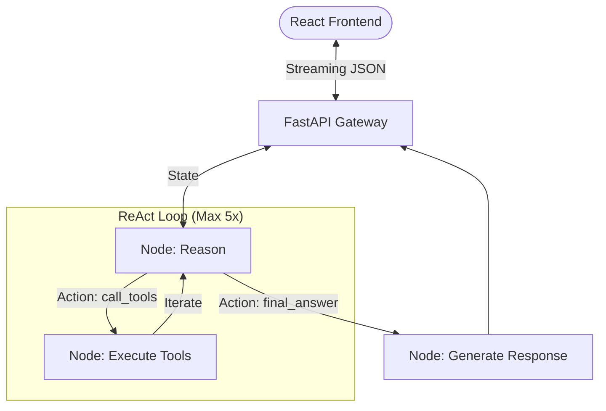

# Architecture: Chat Finance Agentic System 🤖📈

This document provides a detailed overview of the core architecture behind the **Chat Finance** chatbot, powered by **Gemma 3**, **LangGraph**, and a modern web stack.

---

## 🏗️ High-Level Overview

The system is designed as a full-stack agentic application. It separates the heavy-duty reasoning logic (LangGraph) from the high-performance user interface (React) via a streaming FastAPI backend.

### Core Technologies
- **LLM**: `gemma-3-27b-it` (via Google Generative AI)
- **Frontend**: `React` + `Vite` (Modern Finance Dashboard)
- **Backend API**: `FastAPI` (Asynchronous Streaming)
- **Orchestration**: `LangGraph` (ReAct State Machine)
- **Data Sources**: `yfinance`, `ccxt`, `vnstock`, `Tavily`

---

## 📁 Project Structure

### Frontend (`/frontend`)
- **UI Components**: Modular React components (`Sidebar`, `MessageBubble`, `ChatInput`).
- **State Management**: React hooks for managing chat history and real-time market polling.
- **Design System**: Vanilla CSS with glassmorphism and finance-optimized dark mode.

### Backend API (`api.py`)
- **FastAPI**: Serves as the gateway between the frontend and the agent.
- **Streaming**: Uses `StreamingResponse` to push JSON-wrapped thinking steps and final answers to the client.

### Core Agent (`/backend`)
- `backend/state.py`: Defines the `AgentState` schema.
- `backend/utils.py`: JSON parsing, few-shot prompting, and formatting.
- `backend/nodes/`: Individual reasoning, tool execution, and generation nodes.
- `backend/tools/`: Suite of financial and web retrieval tools.
- `backend/graph.py`: LangGraph workflow definition.

---

## 🔄 Agentic Workflow (LangGraph)

The agent operates on a state machine that follows the ReAct pattern. Below is the updated data flow:

### 1. Reason Node (`reason_node`)
Since **Gemma 3** doesn't support native tool binding in this implementation, we use **Few-Shot ReAct Prompting**.
- **Input**: User query + Conversation History + Tool Results.
- **Logic**: Decides whether it has enough data to answer (`final_answer`) or needs more (`call_tools`).

### 2. Execute Tools Node (`execute_tools_node`)
Maps requested actions to Python functions with parallel execution and auto-scraping from search results.

### 3. Generate Response Node (`generate_response_node`)
Synthesizes professional, structured Markdown in Vietnamese once reasoning is complete.

---

## 🛠️ Tool Registry

| Tool | Source | Purpose |
|------|--------|---------|
| `get_stock_price` | yfinance | US equities (AAPL, TSLA) |
| `get_crypto_price` | ccxt/Binance | Crypto prices & 24h trends |
| `get_vn_indices` | vnstock | Market overview (VN-Index, VN30) |
| `get_gold_price` | yfinance | Global Gold (XAU/USD) prices |
| `search_tavily` | Tavily API | Real-time news & search |
| `scrape_web` | BS4 | Detailed content analysis |

---

## 🛠️ Extending the System

The system is designed to be easily extensible. Detailed instructions on how to add new tools (logic, registry, prompts) can be found in the **[.agents/skills/add_tool/SKILL.md](.agents/skills/add_tool/SKILL.md)** file.

---

## ⚡ Real-time Feedback

A unique feature of this architecture is the **Streaming Thinking Process**. The frontend consumes an `application/x-ndjson` stream from FastAPI, allowing it to display intermediate thoughts (`🔍 Phân tích`, `💭 Suy nghĩ`) as they occur, providing transparency.
