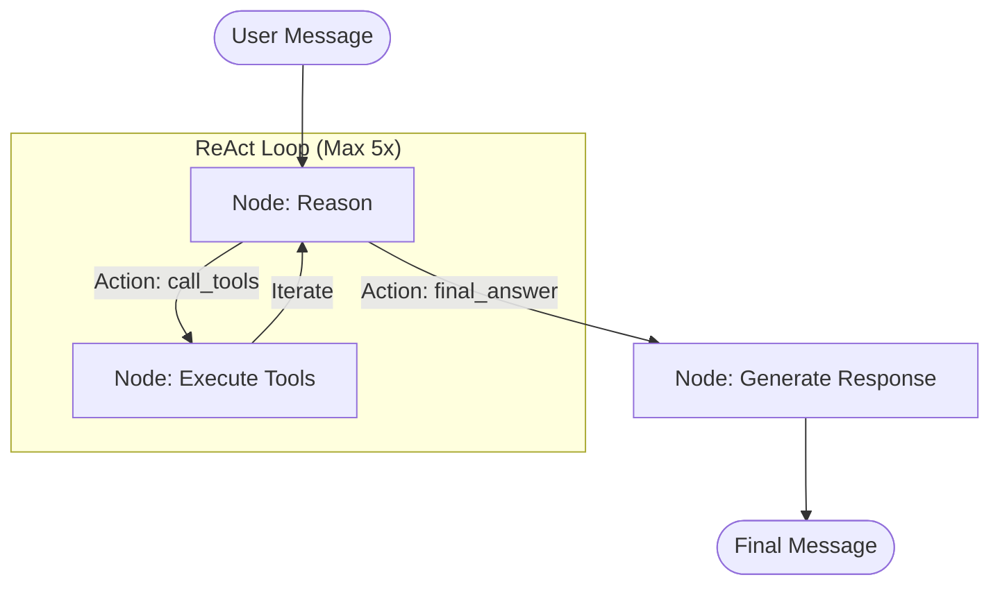

# Architecture: Chat Finance Agentic System 🤖📈

This document provides a detailed overview of the core architecture behind the **Chat Finance** chatbot, powered by **Gemma 3** and **LangGraph**.

---

## 🏗️ High-Level Overview

The system is designed as an autonomous **ReAct (Reason + Act)** agent that can intelligently use a suite of financial and web tools to answer complex queries. Unlike traditional chatbots, it doesn't just "chat"—it reasons about what data it needs, fetches it, and synthesizes a professional financial response.

### Core Technologies
- **LLM**: `gemma-3-27b-it` (via Google Generative AI)
- **Framework**: `LangGraph` (for state machines and workflow)
- **Data Sources**: `yfinance` (US Stocks), `ccxt` (Crypto), `vnstock` (VN Market Data), `Tavily` (Web Search)
- **Scraping**: `BeautifulSoup4` & `Markdownify`

---

## 📁 Backend Structure (Refactored)

To improve maintainability, the LangGraph logic has been modularized:
- `backend/state.py`: Defines the `AgentState` schema.
- `backend/utils.py`: Contains JSON parsing, few-shot prompting, and formatting utilities.
- `backend/nodes/`: Directory containing individual node logic.
    - `reason_node.py`: Main reasoning loop.
    - `execute_tools_node.py`: Tool execution and auto-scraping logic.
    - `generate_response_node.py`: Final response synthesis.
- `backend/tools/`: Directory containing modular tools.
    - `finance/`: Individual finance tool files (get_stock_price, etc.).
    - `web/`: Individual web search and scraping tool files.
    - `registry.py`: Central mapping of tool names to functions.
- `backend/graph.py`: Router logic and LangGraph workflow compilation.
- `backend/agent.py`: Entry point for external usage.

---

## 🔄 Agentic Workflow (LangGraph)

The agent operates on a state machine that follows the ReAct pattern. Below is a visualization of the data flow:

### 1. Reason Node (`reason_node`)
Since **Gemma 3** doesn't support native tool binding in this implementation, we use **Few-Shot ReAct Prompting**.
- **Input**: User query + Conversation History + Tool Results (if any).
- **Processing**: The model is prompted to output a specific JSON structure (e.g., `thought`, `action`, `tools`).
- **Logic**: It decides whether it has enough data to answer (`final_answer`) or needs to fetch more (`call_tools`).

### 2. Execute Tools Node (`execute_tools_node`)
This node maps the model's requested actions to actual Python functions.
- **Parallel Execution**: Multiple tools can be called in a single step (e.g., fetching BTC and AAPL prices simultaneously).
- **Auto-Scraping**: If `search_tavily` returns results, the node automatically extracts URLs and uses `scrape_web` to read the content of the top results, providing much richer context than just snippets.

### 3. Generate Response Node (`generate_response_node`)
Once the "Reason" node decides it has enough data, this node synthesizes the final answer.
- **Transformation**: Converts raw tool data (JSON/text) into professional, structured Markdown in Vietnamese.
- **Consistency**: Ensures the tone remains objective and analytical.

---

## 🛠️ Tool Registry

The agent has access to a specialized set of tools:

| Tool Name | Source | Purpose |
|---|---|---|
| `get_stock_price` | yfinance | Core data for US equities (AAPL, TSLA, etc.) |
| `get_crypto_price` | ccxt/Binance | Real-time crypto prices & 24h trends |
| `get_vn_stock_price` | vnstock | Live prices for HOSE/HNX/UPCOM |
| `get_vn_indices` | vnstock | Market overview (VN-Index, VN30) |
| `get_stock_history` | vnstock | Historical data & trend analysis (30-60 days) |
| `compare_stocks` | vnstock | Performance comparison of multiple tickers |
| `search_tavily` | Tavily API | Real-time news and general web searching |
| `scrape_web` | BS4/Requests | Full-page reading for detailed analysis |

---

## 📝 Prompt Engineering Strategy

We use structured system prompts with **Few-Shot Examples** in `backend/prompts.py` to ensure high reliability.

> [!TIP]
> **Why Few-Shot?** Gemma 3 is highly capable but requires examples to strictly adhere to JSON schemas without conversational filler. This ensures our `_parse_json_response` helper remains robust.

---

## 🧠 Memory Management

Conversation history is managed via a session-based system in `backend/memory.py`.
- **Sliding Window**: We keep the most recent messages to maintain context without overloading the token limit.
- **Context Injection**: Each `reason` step includes the relevant history to support multi-turn inquiries (e.g., "What about its PE ratio?" after asking about a specific stock).

---

## ⚡ Thinking Process Visualization

A unique feature of this architecture is the **Streaming Thinking Updates**. The `get_graph_response` generator yields intermediate thoughts (e.g., `💭 Suy nghĩ: ...`, `🛠️ Gọi tool: ...`) before the final answer, providing transparency to the user.
