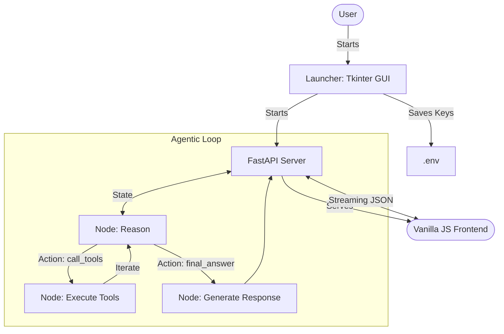

# Architecture: Chat Finance Agentic System 🤖📈

This document provides a detailed overview of the core architecture behind the **Chat Finance** chatbot, powered by **Gemma 3**, **LangGraph**, and a modern web stack.

---

## 🏗️ High-Level Overview

The system is designed as a full-stack agentic application, now enhanced with a **Desktop Launcher** for seamless user experience. It separates reasoning logic (LangGraph) from the UI (Vanilla JS) via a streaming FastAPI backend, all bundled into a single executable.

### Core Technologies
- **LLM**: `gemma-3-27b-it` (via Google Generative AI)
- **Frontend**: `Vanilla JS`, `HTML5`, `CSS3` (Modern Finance Dashboard)
- **Backend API**: `FastAPI` (Asynchronous Streaming & Static File Hosting)
- **Launcher**: `Python` + `Tkinter` (Cross-platform GUI for config)
- **Packaging**: `PyInstaller` (Self-contained binary)

---

## 📁 Project Structure

### Desktop Launcher (`launcher.py`)
- **Key Check**: Validates if `.env` exists and contains valid keys.
- **Config GUI**: Opens a Tkinter window if keys are missing.
- **Orchestration**: Launches the FastAPI server in a background thread and opens the default browser once the server is ready.

### Backend API (`api.py`)
- **Gateway**: Routes requests to the LangGraph agent.
- **Unified Serving**: Serves the **Vanilla JS** static files (from `frontend/`) on the root route, eliminating the need for a separate frontend server or build process.
- **Streaming**: Uses `StreamingResponse` for real-time thinking steps.

### Core Agent (`/backend`)
- `backend/graph.py`: LangGraph workflow definition.
- `backend/nodes/`: Reasoning, Tool Execution, and Generation.
- `backend/tools/`: Financial and web retrieval tools.

---

## 🔄 Data Flow & Workflow

The updated architecture includes the initialization phase:

---

## 🛠️ Packaging & Distribution

The application is packaged using **PyInstaller**:
1. **Frontend Inclusion**: Static HTML/JS/CSS files are bundled directly.
2. **Bundling**: All Python code, dependencies, and frontend assets are compressed into a single binary.
3. **Distribution**: 
    - **Linux**: A shell script handles `.desktop` entry creation.
    - **Windows**: A batch file creates a desktop shortcut.

---

## 🛠️ Tool Registry

| Tool | Source | Purpose |
|------|--------|---------|
| `get_stock_price` | yfinance | US equities (AAPL, TSLA) |
| `get_crypto_price` | ccxt/Binance | Crypto prices & 24h trends |
| `get_vn_indices` | vnstock | Market overview (VN-Index, VN30) |
| `get_gold_price` | yfinance | Global Gold (XAU/USD) prices |
| `search_tavily` | Tavily API | Real-time news & search |
| `scrape_web` | BS4 | Detailed content analysis |

---

## ⚡ Real-time Feedback

A unique feature of this architecture is the **Streaming Thinking Process**. The frontend consumes an `application/x-ndjson` stream from FastAPI, allowing it to display intermediate thoughts (`🔍 Phân tích`, `💭 Suy nghĩ`) as they occur, providing transparency.

